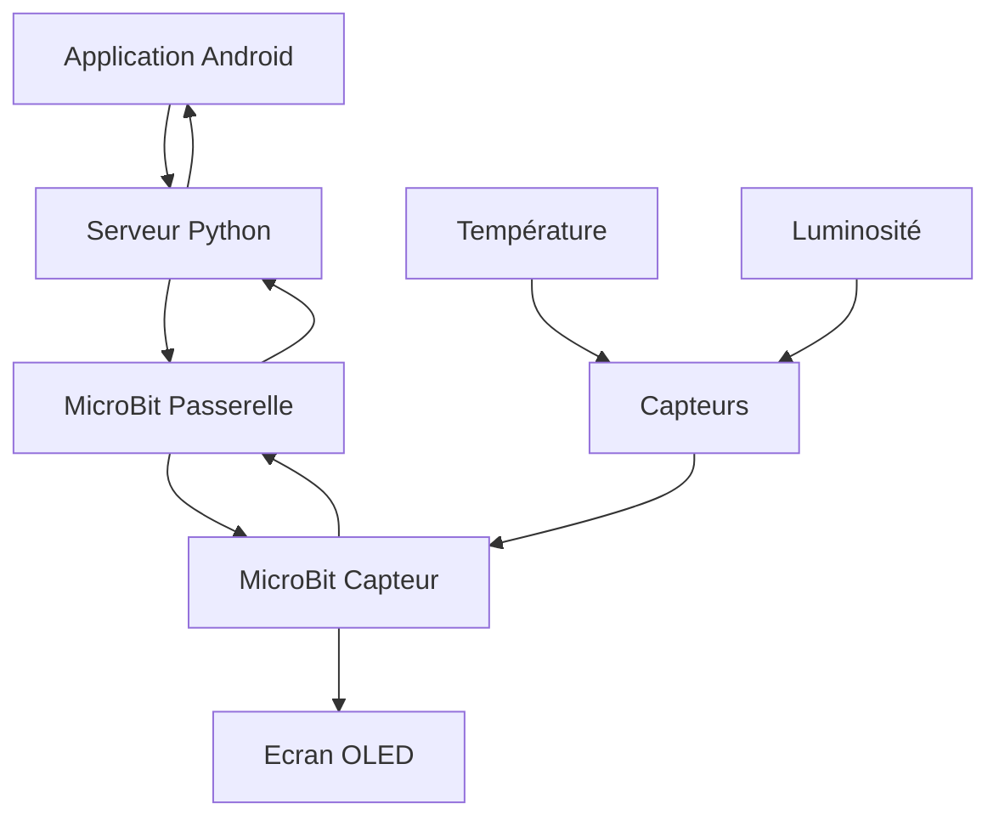

# Projet-IOT

Repository des fichiers sources du projet IOT 4IRC

Branche : **Passerelle**

### Infrastructure objet-passerelle

- Mise en place du réseau
		○ Canal bi-directionnel
		○ Sécurité des données envoyées
    
- Configuration des capteurs
  - Température
  -  Luminostié
  -  Données envoyé dans l'ordre demandé par le serveur
  -  OLED
    -  Affichage des données envoyées depuis le microbit
    -   Communication avec la passerelle
        -   Format de données brute
        -   -> à remplacer par le format json
        -   TL : Température puis Luminosité
        -   LT : Luminosité et Température
- configuration de la passerelle et serveur
    - Mettre à disposition un serveur qui écoute 
        - Stocke les données en brut puis en base de données
          - Définition du format d'échange
          - faire une interface web avec Grafana
          - Gestion de plusieurs objets
- Application Android
  - 1 - choix de l'affichage
    - Définir l'ordre d'affichage des données collectées 
  - 2 - définir le serveur de destination
    - Port d'écoute
    - Envoie
    - UDP
  - 3 - Communication bidirectionnelle avec le smartphone
    - Écoute des messages envoyés du serveur

