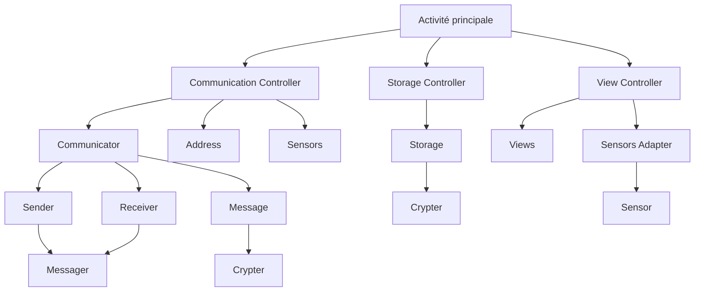

# Application Android

## Description

### Connexion

L'application Android permet de gérer les données affichés sur l'écran OLED.

Pour ça on définis l'adresse IP et le port du serveur que l'on souhaite utiliser.

Puis on lance la connexion.

### L'affichage

Les données des capteurs récupérés depuis le serveur sont affichés sur l'écran sous une forme de liste.

L'ordre de cette liste est affiché en fonction des données reçus par le serveur.

Grâce à des boutons fléchés, on peut choisir de changer l'ordre d'affichage des données.

## Architecture

L'application Android est composé en trois niveaux principaux :
1. L'activité principale
2. Les controllers
3. Les classes utilitaires

### L'activité principale

L'activité principale est la classe principale de l'application.

Elle est appelé au lancement de l'application et permet de gérer les différents appelles.

### Les controllers

Les controllers vont pouvoir chacun gérer une partie importante de l'application. (Communication avec le serveur, affichage des données, accès au stockage.)

### Les classes utilitaires

Les classes utilitaires vont permettre de gérer des données de manière plus simple.

Elles sont utilisées par les controllers pour gérer les données.

### Graphique de l'architecture

## Particularités de l'application

### Affichage

L'affichage peut être rechargé en tirant la liste vers le bas.

La liste est dynamique et peut contenir autant d'éléments que reçu.

L'icone de l'application supporte les icônes à thème d'Android 13.

### Communication

La communication avec le serveur est gérée par un thread et est donc non bloquante pour le reste de l'application.

La communication est sécurisée par un chiffrement césar.

### Stockage

Le stockage des données est géré dans un fichier JSON.

L'adresse IP et le port du serveur sont stockés dans le fichier.

Le stockage est sécurisé par un chiffrement césar.

